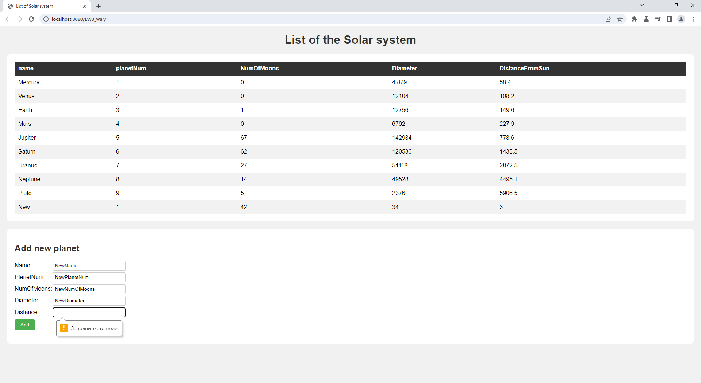

## Задание
Разработать страницу, отображающую список объектов, с хранением их на сервере файле. передача данных осуществляется по JSON, клиент и сервер общаются по средством передачи данных. Применить шаблон проектирования MVC. На странице предусмотреть форму добавления объектов в список.

Темы списков оставляете из лабораторной работы 2.

## Результат

