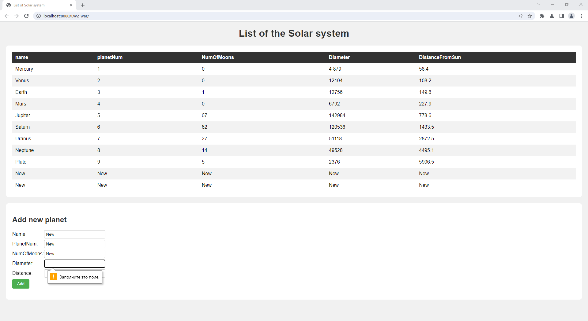

## Задание
Разработать страницу отображающую список объектов, с хранением их на сервере в файле, передача данных осуществляется по JSON, клиент и сервер общаются по средством передачи данных. На странице предусмотреть форму добавления объектов в список.

Можно выбрать любую свою тему.

## Результат

