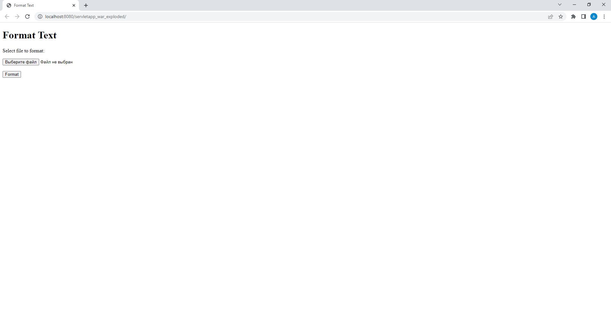

## Задание
Создать сервлет и взаимодействующие с ним пакеты Java-классов и HTML-документов.
Готовое веб-приложение разместить на сервере Tomcat.
Осуществить форматирование выбранного пользователем текстового файла, так чтобы длина каждой строки была ровно 80 символов, а все абзацы имели отступ ровно 3 пробела.

## Результат

