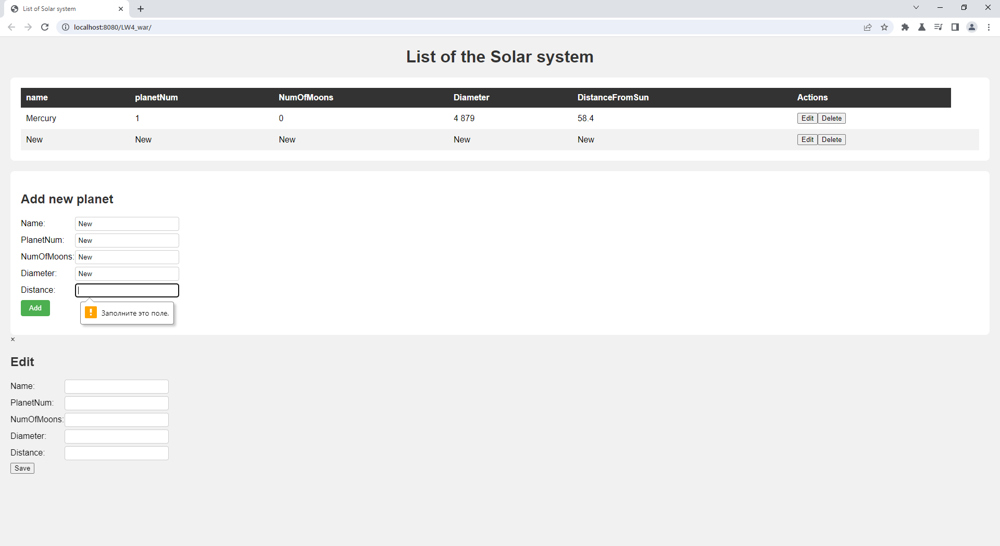
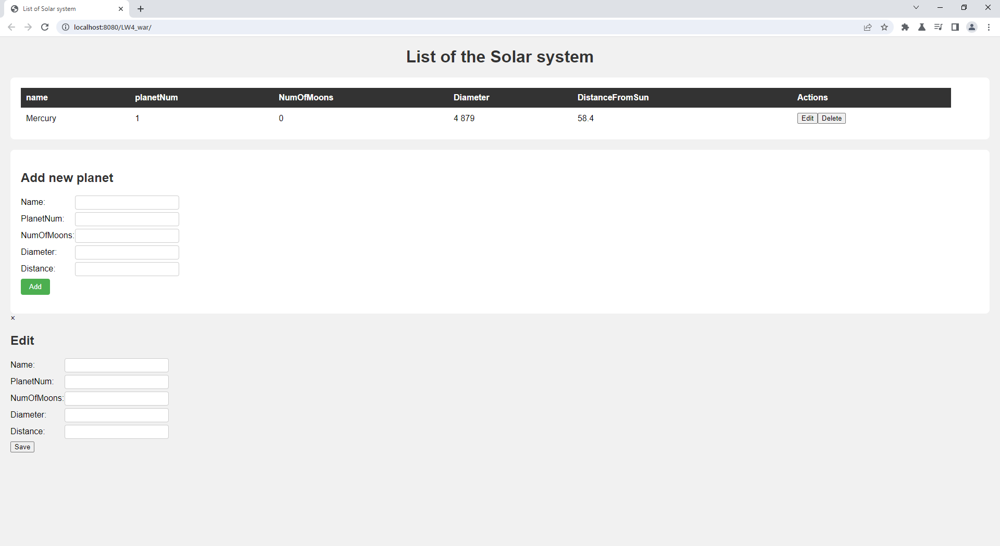
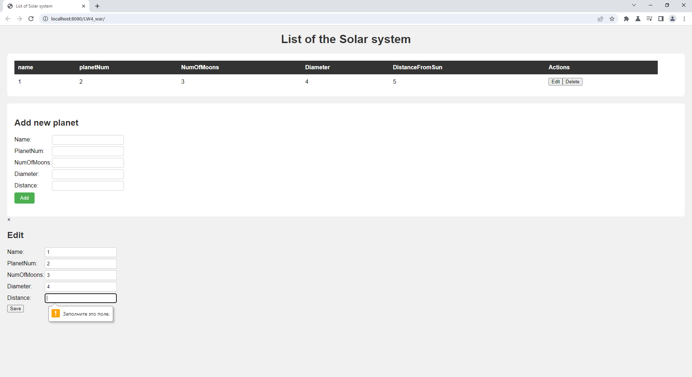
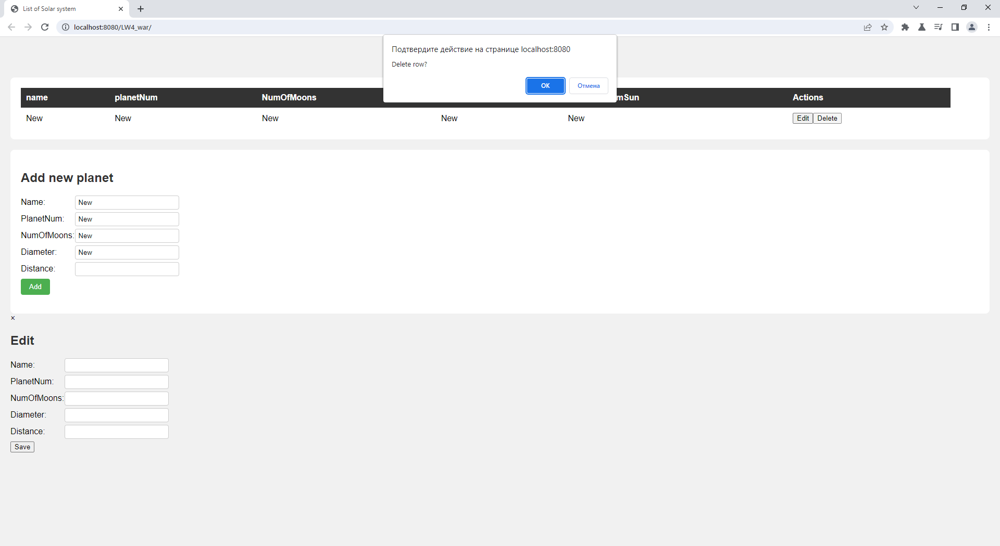

## Задание
Посмотрите видео 7 шт. о том как работать с драйвером для подключения БД, используйте MySQL WorkBench, все выполняйте как в лаб 3, только вместо файла сохраняете в БД. Внимательно!!! Должны быть все четыре элемента CRUD (create-read-update-delete)

Темы списков оставляете из лабораторной работы 3.

## Результат
### MySQL Workbench

### Create

### Read

### Update

### Delete

